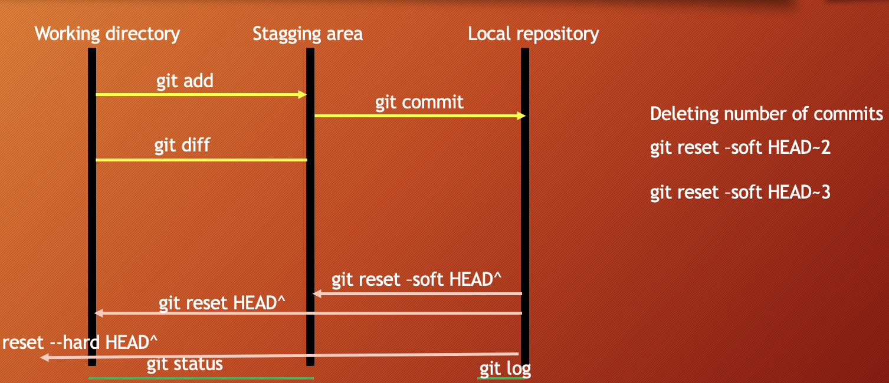

# Git & GitHub Documentation

## Lesson 1. Introduction to git and GitHub

1. git?
   - git is a version control software
   - It keep track of code changes
   - It helps to collaborate in a project
   - It is installed and maintained locally
   - It provides Command Line Interface (CLI)
   - Released in April 7, 2005
   - Developed by Linus Torvalds & Junio C Hamano
2. github?
   - GitHub is a hosting service where we can keep our git repositiory/folders
   - It is maintained on cloud/web
   - It provides Graphical User Interface (GUI)
   - Founded in 2008


     
<br/>

## Lesson 2. How to set git environment and configuration
- Download and install git on your pc: https://git-scm.com/
- check git version: open terminal or cmd then use the command `git --version` to find out whether git is installed or not. if git is installed it will return a version number of git.

<br/>

### git configuration

1.  check all configuartion options: `git config`
2.  set global user name and user email for all repository/git folders (if you want to set different username and email for different git repository then remove --global)
    - set global user name: `git config --global user.name "sarwar71"`
    - set global user email: `git config --global user.email "sarwar@gmail.com"`
3.  list all git configuration:
    - list all the configuration: `git config --list`
    - list user name: `git config user.name`
    - list user email: `git config user.email`
4.  change global username & email
    - change global user name: `git config --global user.name "PUT_NEW_USER_NAME_HERE"`
    - change global user email: `git config --global user.email "PUT_NEW_USER_EMAIL_HERE"`

<br/>

## Lesson 3. creating git repo and adding new files

1.  creating a git folder

- ls -a : list all files inside of a directory

  ```
  mkdir DIRECTORY_NAME_HERE
  cd DIRECTORY_NAME_HERE
  git init

  Example:
  mkdir notes
  cd notes
  git init
  ls -a
  ```

2.  adding new files in git folder

- git status : displays the state of the working directory and staging area

  ```
  ls -a
  touch fileName.extension
  open fileName.extension
  git status

  Example:
  touch day1.txt
  open day1.txt
  write something inside the file
  ```

- Git is aware of the file but not added to our git repo
- Files in git repo can have 2 states – tracked (git knows and added to git repo), untracked (file in the working directory, but not added to the local repository)
- To make the file trackable stagging or adding is required

<br/>

## Lesson 4. how to add files in staging area & remove files

1.  adding files to stagging area:

- `git add fileName` add a file in staging area / index
- `git add .` add all files of directory to stagging area but not subdirectory
- `git add -A` add all files of directory and subdirectory to stagging area
- `git add *.js` directory wildcard
- `git add **/*.js` directory & subdirectory wildcard
- `git rm --cached fileName` unstage a file from staging area
- `git diff` checking the differences of a staged file
- `git restore fileName` restore/undo the file changes

<br/>

## Lesson 5. commit & uncommit

- `git commit -m "message"` move the file to local repository from stagging area
- `git log` check the commit history
- `git reset --soft HEAD~` uncommit the commit in HEAD and move to staging area
- `git reset HEAD~` uncommit the commit in HEAD and move to unstaging / working area
- `git reset --hard HEAD~` uncommit the commit in HEAD and delete the commit completely with all the changes



<br/>

## Lesson 6. git HEAD and undo theory

- `git log --oneline`
- `git show`
- `git show HEAD`
- `git show commit-id`
- `git checkout commit-id`
- `git checkout master`

<br/>

## Lesson 7. git ignore

- create a .gitignore file and add the things you do not want to add in the stagging area
- Inside .gitignore we can keep secret files, hidden files, temporary files, log files
- `secret.txt` secret.txt will be ignored
- `*.txt` ignore all files with .txt extension
- `!main.txt` ignore all files with .txt extension without main.txt
- `test?.txt` ignore all files like test1.txt test2.txt
- `temp/` all the files in temp folders will be ignored

<br/>

## Lesson 8. create github repository and commits

- sign in to your github account
- create a git repo

<br/>

## Lesson 9. Connecting local repo to remote repo

- check remote connection: `git remote` or `git remote -v`
- `git remote add name <REMOTE_URL>` example: git remote add origin https://github.com/sarwar71/github-documentation.git
- to clone a remote repository: `git clone <REMOTE_URL>`

<br>

## Lesson 10. push and pull

- push a branch `git push -u origin branch_name`
- push all branches `git push --all`
- pull from a repo: `git pull` which is equivalent to git fetch + git merge

<br>

## Lesson 11. branching and merging

- Branch is a new and separate branch of master/main repository
- Create a branch `git branch branch_name`
- List branches `git branch`
- List all remote branches `git branch -r`
- List all local & remote branches `git branch -a`
- Move to a branch `git checkout branch_name`
- Create and move to a branch `git checkout -b branch_name`
- Delete a branch: `git branch -d branch_name`
- Merge branches:
  ```
    git checkout branchName
    git merge branchName
  ```
- `git log --oneline --all --graph`

<br>

## Lesson 12. 2-way and 3-way merges

- Reeference:
  - https://www.tutorialspoint.com/what-is-a-fast-forward-merge-in-git
  - https://www.tutorialspoint.com/what-is-3-way-merge-or-merge-commit-in-git
  - https://medium.com/@koteswar.meesala/git-fast-forward-merge-vs-three-way-merge-8591434dd350

<br>

## Lesson 13. Merge Conflicts

- https://www.tutorialspoint.com/what-is-merge-conflict-in-git-how-to-handle-merge-conflicts

<br>

## Lesson 14. Git-School: Practicing & Visualizing
- http://git-school.github.io/visualizing-git/
- https://github.com/git-school/visualizing-git